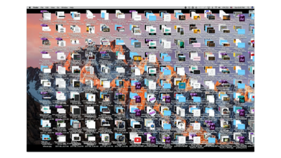
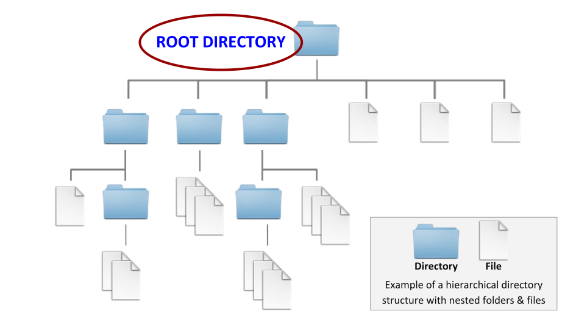
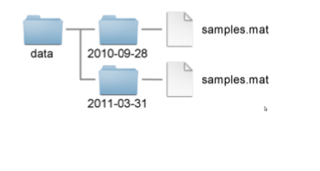
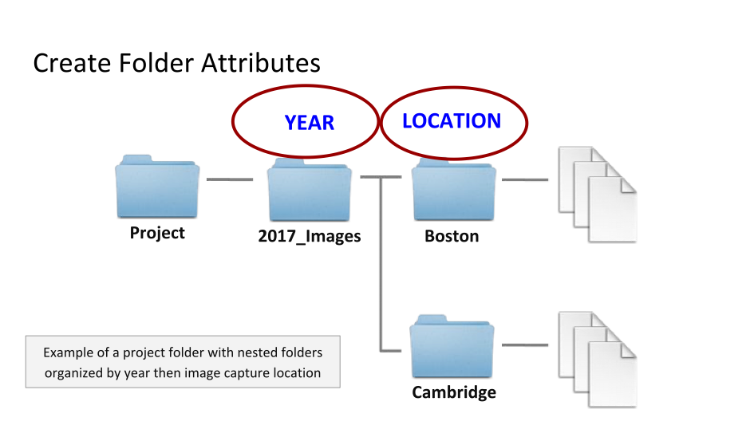
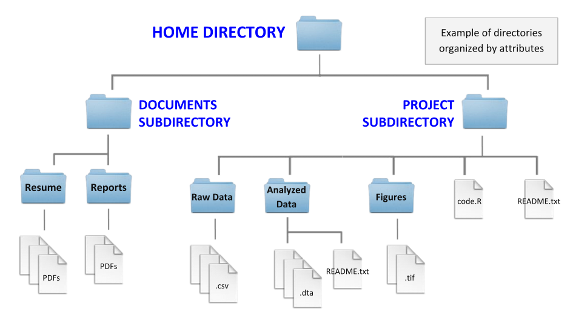

> ## About this episode 
> This episode addresses some of the reasons to why file organisation is important for data management and a selection of good practices for organising research folders and files. The aim is to get you started and thinking about what will work for you and your project or team. Depending on your research area and the type of research you're involved in; you may find a more optimal way to organize your work.
>
> * TOC
> {:toc}
> {: .toc}
{: .callout .toc}

## Good practices for organising files and folders
Depending on your background and experiences you could be thinking of different reasons to why it would be beneficial or useful to systematically organise your research and data files. The following is a selection of common reasons:

* Easier to locate a file
* Find similar files together
* Moving files becomes much easier
* Easy to identify which files you want to back up
* Keep organised in the long-run
* Increases productivity
* Helps you to keep and maintain a record of the project
* Projects can easily be understood by others (including your future self)

It’s natural for some of your files get unorganised from time to time—perhaps your downloads or desktop folder—and in those cases there may be multiple copies and versions of files cluttering your view and making it challenging to find what you're looking for. You can avoid this clutter by planning for organising your files ahead of time, and any system is better than none.
<!--


-->


In this context we will be looking into practices for classifying and structuring files and folders to make them more useful. Your guiding principle should be that someone unfamiliar with your project should be able to look at your files and understand, in detail, what you did and why. This someone could be a researcher who wants to reproduce the results in your article, a new collaborator who needs to understand the details of your experiments, or—more commonly—that someone could be your future self not remembering what you were up to when you created a particular set of files.  Poor organisation practices can lead to significantly slower research progress and you may end up having to spend significant time reproducing results from previous experiments or completely reconstructing an analysis to address minor flaws, new data or a new technique


## How to organise files and folders
Spend some time planning how you are going to organise your data at the beginning of a project. Consider how you and others will look for and access the files throughout the project’s life cycle and ensure that all people involved can commit to using the folder hierarchy, file naming conventions, and a strategy for onboarding new contributors. You can start small and expand as you develop your practices.


### Organise files hierarchically
Folders are containers for your files and are sometimes called directories. A folder can contain other folders—sometimes called subfolders (or subdirectories)—and you can organise your files hierarchically by creating a structure of folders and subfolders. Each folder corresponds to a category that should be mutually exlusive with other folders at the same level. And since a file can only be placed in one folder—at one place in the hierarchy—you should aim to create a structure that make it easy for yourself and your collaborators to determine where any given file should be located.



In cases where files needs to be disperserd across several storage solutions, it can be a good idea to imagine a virtual top level of the folder hierarchy where each subfolder correspons to a storage solution. This virtual hierarchy can be described in a shared document to allow your collaborators to determine on which storage solution any any given file should be located.

### Use folders to divide files into categories
Put each project in its own folder named after that project. Ideally you want to keep the folder’s name under 32 characters long while at the same time including a combination of the project title a unique identifier and the date. 

Consider the best hierarchy for the files in the project and decide whether a deep or shallow hierarchy is preferable. If you have several independent data collections, it is advisable to create a separate data folder for each collection. But you can use any meaningul characteristic or file attribute as a basis for organising your file, which of them will be most helpful varies widely across domains and specific projects. 



{: .img-box}

> ### Discussion
> What are examples of characteristics or file attributes that could be helpful categories?
>
>> ### Examples of helpful characteristics or file attributes
>> * Year or other date
>> * Type of data, document or file
>> * Project stages
>> * Analysis version or revision
>> * Experiments 
>> * Instruments
>> * Time periods
>> * Geographic location
>> * Storage requirements
>> * Team member, institution or project site
> {: .solution}
{: .discussion}




{: .img-box}

### Choose a file naming strategy
Two important starting points for your file naming strategy are:

- #### A file name is a principal identifier of a file
    Good file names provide useful clues to the content, status and version of a file, uniquely identify a file and help in classifying and sorting files. File names that reflect the file content also facilitate searching and discovering files. In collaborative research, it is essential to keep track of changes and edits to files via the file name.
- #### File naming strategy should be consistent in time and among different people
    In both quantitative and qualitative research file naming should be systematic and consistent across all files in the study. A group of cooperating researchers should follow the same file naming strategy and file names should be independent of the location of the file on a computer.


### Create documentation files
Systematically documented research data is the key to making the data publishable, discoverable, citable and reusable. Clear and sufficiently detailed documentation improve the overall data quality. It is vital to document both the study for which the data has been collected and the data itself. These two levels of documentation are called project-level and data-level documentation and can both be saves as files and stored in your file hierarchy.

A common practice it to use plain text files – a very simple form of text documents that only contain characters. These files are often called README-files and can be placed strategically across your file hierarchy to help people find what they want or direct them to where further project-level or data-level documentations can be found. 


### Examples
How many folders and how deeply nested subfolders you use will depend on many factors, such as the complexity or length of the project or the number of collaborators working on a project. A multi-year project with many contributors and subcontracors may result in lots of folders and files.

You should try to establish a structure early and be prepared to adapt it as needed to remain organized throughout the duration of the project. The best way to organize your folders really depends on the attributes that are most helpful to your project and, again, how many files you will be working with. 





The following is a structure proposed for computational biology projects. The data folder is for storing our fixed data sets and we see data sets are organized by date. You can see README  files in each of the yeast and worm data folders. The src folder contains source code and code, the bin folder compiled binaries or  scripts and the results folder is for tracking  computational experiments performed on the data. This could be a helpful structure to follow  if you are running a computational experiment.


<!--
### Summary

* There is a folder for the raw data, which do not get altered, or intermixed with data that is the result of manual or programmatic manipulation. I.e., derived data is kept separate from raw data, and raw data are not duplicated.
* Code is kept separate from data.
* Use a version control system (at least for code) 
* There is a scratch fodler for experimentation. Everything in the scratch fodler can be deleted at any time without negative impact.
* There should be a README in every fodler, describing the purpose of the fodler and its contents.
* Use file naming schemes that makes it easy to find files and understand what they are (for humans and machines)
* Use non-proprietary formats – .csv rather than .xlsx
-->

## How to name files and folders

Use a File Naming Convention is a framework or protocol if you like for naming your files in a way that describes what files contain and importantly, how they relate to other files. 

| ---- |---|
| Bad                                                 | Better |
| ---- |---|
| myabstract.docx                                     | 2014-06-08_abstract-for-sla.docx |
| Joe’s Filenames Use Spaces and Punctuation.xlsx     | joes-filenames-are-getting-better.xlsx |
| figure 1.png                                        | fig01_scatterplot-talk-length-vs-interest.png |
| fig 2.png                                           | fig02_histogram-talk-attendance.png |
| JW7d^(2sl@deletethisandyourcareerisoverWx2*.txt     | 1986-01-28_raw-data-from-challenger-o-rings.txt |

> ### Discussion
> What are potential benefits of a File Naming Convention?
>
>> ### Potential benefits of a File Naming Convention
>> - Easier to process - All team members won’t have to over think the file naming process
>> - Easier to facilitate access, retrieval and storage of files
>> - Easier to browse through files saving time and effort
>> - Harder to lose!
>> - Having logical and known naming conventions in place can also help you with version control (See Version Control for more information).
>> - Check for obsolete or duplicate records
> {: .solution}
{: .discussion}

### Three principles for (file) names:

1. Machine readable – avoid spaces, deliverate punctuation, no accented characters, consistent letter casing
1. Human readable - a name describes the content of the file, connects to concept of a *slug* from semantic URLs
1. Plays well with default ordering – put something numeric first, use the ISO 8601 standard for dates, left pad other numbers with zeros


#### Search and filtering friendly

**Except of complete file listing**:


**Same using Mac OS Finder search facilities**:


**Same using regex in `R`**:


#### Encode/extract metadata from filenames

Deliberate use of "-" and "_" allows recovery of meta-data from the filenames:

- "_" underscore used to delimit units of meta-data I want later.
- "-" hyphen used to delimit words so my eyes don't bleed.


This happens to be `R` but also possible in the `shell`, `Python`, etc.

##### Descriptive filenames

**Which set of file(name)s do you want at 3 a.m. before a deadline**?


##### Embrace the *slug*


##### Recap: Human readable

Easy to figure out what the heck something is, based on its name


#### Plays well with default ordering

**Chronological order**:


**Logical order**: Put something numeric first


**Dates**: Use the ISO 8601 standard for dates: YYYY-MM-DD


**Left pad other numbers with zeros**


If you don’t left pad, you may get this:

```
 10_final-figs-for-publication.R
 1_data-cleaning.R
 2_fit-model.R
```

> ### Create your own File Naming Convention 
> [Briney, Kristin A. (2020) File Naming Convention Worksheet. [Teaching Resource] (Unpublished)](https://resolver.caltech.edu/CaltechAUTHORS:20200601-161923247)
> 1. What group of files will this naming convention cover?
> 1. What information (metadata) is important about these files and makes each file distinct?
> 1. Do you need to abbreviate any of the metadata or encode it?
> 1. What is the order for the metadata in the file name?
> 1. What characters will you use to separate each piece of metadata in the file name?
> 1. Will you need to track different versions of each file?
> 1. Write down your naming convention pattern
> 1. Document this convention in a README.txt (or save this worksheet) and keep it with your files
{: .callout}

> ### Further reading
>
> - [ELIXIR (2021) Data organisation. In Research Data Management Kit. A deliverable from the EU-funded ELIXIR-CONVERGE project (grant agreement 871075).](https://rdmkit.elixir-europe.org/data_organisation.html)
> - [Briney, Kristin A. (2020) File Naming Convention Worksheet. [Teaching Resource] (Unpublished)](https://resolver.caltech.edu/CaltechAUTHORS:20200601-161923247)
>
{: .callout}