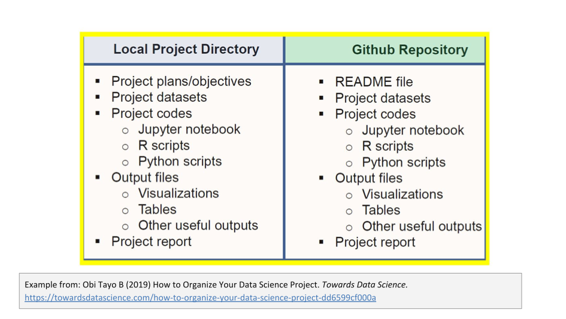

> ## About this episode 
> This episode addresses some of the reasons to why file organisation is important for data management and a selection of good practices for organising research folders and files. The aim is to get you started and thinking about what will work for you and your project or team. Depending on your research area and the type of research you're involved in; you may find a more optimal way to organize your work.
>
> * TOC
> {:toc}
> {: .toc}
{: .callout .toc}

## Good practices for organising files and folders
Depending on your background and experiences you could be thinking of different reasons to why it would be beneficial or useful to systematically organise your research and data files. The following is a selection of common reasons:

* Easier to locate a file
* Find similar files together
* Moving files becomes much easier
* Easy to identify which files you want to back up
* Keep organised in the long-run
* Increases productivity
* Helps you to keep and maintain a record of the project
* Projects can easily be understood by others (including your future self)

It’s natural for some of your files get unorganised from time to time—perhaps your downloads or desktop folder—and in those cases there may be multiple copies and versions of files cluttering your view and making it challenging to find what you're looking for. You can avoid this clutter by planning for organising your files ahead of time, and any system is better than none.
<!--


-->


In this context we will be looking into practices for classifying and structuring files and folders to make them more useful. Your guiding principle should be that someone unfamiliar with your project should be able to look at your files and understand, in detail, what you did and why. This someone could be a researcher who wants to reproduce the results in your article, a new collaborator who needs to understand the details of your experiments, or—more commonly—that someone could be your future self not remembering what you were up to when you created a particular set of files.  Poor organisation practices can lead to significantly slower research progress and you may end up having to spend significant time reproducing results from previous experiments or completely reconstructing an analysis to address minor flaws, new data or a new technique


## How to organise files and folders
Spend some time planning how you are going to organise your data at the beginning of a project. Consider how you and others will look for and access the files throughout the project’s life cycle and ensure that all people involved can commit to using the folder hierarchy, file naming conventions, and a strategy for onboarding new contributors. You can start small and expand as you develop your practices.


### Organise files hierarchically
Folders are containers for your files and are sometimes called directories. A folder can contain other folders—sometimes called subfolders (or subdirectories)—and you can organise your files hierarchically by creating a structure of folders and subfolders. Each folder corresponds to a category that should be mutually exlusive with other folders at the same level. And since a file can only be placed in one folder—at one place in the hierarchy—you should aim to create a structure that make it easy for yourself and your collaborators to determine where any given file should be located.


In cases where files needs to be disperserd across several storage solutions, it can be a good idea to imagine a virtual top level of the folder hierarchy where each subdirectory correspons to a storage solution. This virtual hierarchy can be described in a shared document to allow your collaborators to determine on which storage solution any any given file should be located.

### Use folders to divide files into categories
Put each project in its own folder named after that project. Ideally you want to keep the folder’s name under 32 characters long while at the same time including a combination of the project title a unique identifier and the date. 

Consider the best hierarchy for the files in the project and decide whether a deep or shallow hierarchy is preferable. If you have several independent data collections, it is advisable to create a separate data folder for each collection. But you can use any meaningul characteristic or file attribute as a basis for organising your file, which of them will be most helpful varies widely across domains and specific projects. 


{: .img-box}

> ### Discussion
> What are examples of characteristics or file attributes that could be helpful categories?
>
>> ### Examples of helpful characteristics or file attributes
>> * Year or other date
>> * Type of data, document or file
>> * Project stages
>> * Analysis version or revision
>> * Experiments 
>> * Instruments
>> * Time periods
>> * Geographic location
>> * Storage requirements
>> * Team member, institution or project site
> {: .solution}
{: .discussion}


{: .img-box}

### Choose a file naming strategy
Two important starting points for your file naming strategy are:

- #### A file name is a principal identifier of a file
    Good file names provide useful clues to the content, status and version of a file, uniquely identify a file and help in classifying and sorting files. File names that reflect the file content also facilitate searching and discovering files. In collaborative research, it is essential to keep track of changes and edits to files via the file name.
- #### File naming strategy should be consistent in time and among different people
    In both quantitative and qualitative research file naming should be systematic and consistent across all files in the study. A group of cooperating researchers should follow the same file naming strategy and file names should be independent of the location of the file on a computer.


### Create documentation files


structure is to create documentation files and  someone called out readme's earlier in the chat so what if we give data access to a collaborator  um you know a new student joins the project or it's three years later and we have  forgotten the various stages of the of you know the project that happened what do  we do so we need context and we usually add it um with some metadata in the form of descriptive  text files or readme files and a good way to think of readme files or metadata is as an information  kiosk so you place a small number of information in strategic places so that people who are  lost can find what they want or where to go so to so create this documentation or  readme file across your directory levels and briefly uh describe the contents so let's see  this in action so for example a readme text file  


at the project level will contain some  information about that project including  
maybe the names and the contacts of each of the  researchers and the project folder file structure  
however if you have more than a few data files  it can quickly become critical to add metadata  
files to describe all the files within each  directory so for example at the experiment level  
a readme should include your naming conventions  and briefly describe all the contents such as  
how data was collected any data versions  and just any other important information  
so we will be talking about readmes in a future  session so i highly encourage you to tune in for  

### Examples
that great so we've gone through our principles so  let's look at some examples at different directory  


levels and with varying level of detail and these  will use the principles we just went through  
and hopefully um they will help you determine  what best structure and organization works for  
you and your type of project so here is a very  high level look at what you may see available
see four available directories here the  top level directory is for an organization  
then divided by departments teams  and then projects and we will talk  
more about this during the dropbox class  in a few weeks but you may have some shared  
subdirectories that are available for  collaboration across departments and groups  
so it is important to understand how your  department or team operates because that should  


be reflected within your file structure so next  example this home directory has two subdirectories  
documents and project and within the project  folder there are further subdirectories for  
your raw data analyze data and some figures  so remember here to always keep your raw data  
separate another good practice is to make  the files or the folder with your raw data  
read read only so that someone doesn't  inadvertently alter it in some way  
and here we see the projects code dot r file and  examples of both a project level readme and a  
data set level readme text file so in addition we  see that this group is also maintaining documents  
for resumes and reports which is keeping the  administrative files separate from our working  


research files okay so looking at a project with a  little more going on uh we see that the number of  
subdirectories and nested folders will grow based  on many contributing factors like the complexity  
of a project the length of a project or the number  of team members working on a project so in this  
single project directory there is an example of  a multi-year project that may result in lots of  
folders and lots of files this is to encourage  you to establish a structure ahead of the project  
and adapt the workflow as needed and try to remain  organized throughout the duration of your project  
also remember you don't want to let this  get too deep so think of ways to streamline  
folders where you can how you organize your  folders really depends on those attributes  
and those attributes that are important to your  project and again how many files you will be  


working with okay so this is a very specific  example for organizing a computational biology  
project a nice practical example maybe for  some of you and we have a project named msms  
with a few subdirectories and the doc directory  has additional subdirectories for our manuscripts  
the data directory is for storing our fixed data  sets and we see data sets are organized by date  
using that iso standard and you can see readme  files in each of the yeast and worm data folders  
then the source folders for source  code and the source code ms-analysis.c  
is compiled to create a script files script  file that is documented in that document folder  
so the bin folder is for compiled binaries or  scripts and the python script is called by both  
of the run all driver  scripts for the results files  
and finally the results directory is for tracking  computational experiments performed on that data  
so the driver script runoff automatically  generates the three subdirectories split one split  
two and split three corresponding to those to the  three cross validation splits for this project  
so this is a really good structure to follow  if you are running a computational experiment  
and also i hope this highlights how  automation can actually keep you  



organized as well so lastly and related  to the previous example is a strategy for  
keeping data science projects consistent across  all the systems and platforms you may be using  
so here we see a practical example of how you  would structure your local project directory on  
your computer and how that structure should  then be mirrored on your github repository  
so this makes going between the two platforms  seamless and also allows you to easily sync push  
or pull files when working with them also keeping  good records of all your current and completed  
projects enables you to create a repository where  you can save all your projects for future use  
this is also emphasizing good practice to  maintain two versions of your project and files  
you know one locally and then one that's backed  up great so we've gone through some practices  


and some practical examples so here is a nice  resource a checklist you can use to follow the top  
five practices we outlined today and the worksheet  does also have a generic example we looked at  
so hopefully this is a useful resource um for  you to include in your group or lab protocols  
to ensure that everyone is following these best  practices so you can download this checklist from  
the link on the slides and i will also  send out the link in a follow-up email  

### Takeaways
okay to summarize today's session remember  organization is a key aspect of data management  
and will help keep the project on track by saving  time storage and data loss remember to think  
hard at the beginning of your project about how  you are going to organize your data as it grows  
something that works well for one  file or two files won't necessarily  
work for you know 100 files so try to  structure project folders hierarchically  
and divide data into those  categories that we talked about
there are many different ways  that many different categories  
that we can use so directories can  be organized in many different ways  
so therefore most importantly consider what makes  sense for you and your project team and how people  
new to the project might look for files so again  i can't emphasize this enough but establishing a  
system from the start allows for standardized data  collecting and analysis by you know a whole team  
so remember we have a few more webinars left  this summer next week we will build on the  
structures we talked about today focusing on  naming files and folders within our system  
so thank you for joining today the recording  and the slides will be posted on our website  
i would appreciate your feedback  on today's session so please  
fill out the survey at the link provided  on the slide so thank you everyone i will  
send out an email with the recording and  the slides and the checklist resource

* There is a folder for the raw data, which do not get altered, or intermixed with data that is the result of manual or programmatic manipulation. I.e., derived data is kept separate from raw data, and raw data are not duplicated.
* Code is kept separate from data.
* Use a version control system (at least for code) 
* There is a scratch directory for experimentation. Everything in the scratch directory can be deleted at any time without negative impact.
* There should be a README in every directory, describing the purpose of the directory and its contents.
* Use file naming schemes that makes it easy to find files and understand what they are (for humans and machines)
* Use non-proprietary formats – .csv rather than .xlsx


## How to name files and folders

https://orchid00.github.io/ReproducibleResearchThings/02-naming/index.html

https://datacarpentry.org/rr-organization1/

https://carpentries-incubator.github.io/life-sciences-workshop/02-data-management-filenaming-and-folders/index.html


* Machine readable
* Human readable
* Play well with default ordering

* Identifies the file
* Don't rely on file names to store metadata
* Conventions to correlate files

### Using folders for group level processing

* Absolute / relative path
* Access control
* Back-up
* Storage media
* Archived versions
* Write protection
* Temporary

### Creating a file naming convention
Briney, Kristin A. (2020) File Naming Convention Worksheet. [Teaching Resource] (Unpublished) https://resolver.caltech.edu/CaltechAUTHORS:20200601-161923247 


#### NO
```
myabstract.docx
Joe’s Filenames Use Spaces and Punctuation.xlsx
figure 1.png
fig 2.png
JW7d^(2sl@deletethisandyourcareerisoverWx2*.txt
```

#### YES
```
2014-06-08_abstract-for-sla.docx
joes-filenames-are-getting-better.xlsx
fig01_scatterplot-talk-length-vs-interest.png
fig02_histogram-talk-attendance.png
1986-01-28_raw-data-from-challenger-o-rings.txt
```

### Three principles for (file) names:

1. Machine readable
1. Human readable
1. Plays well with default ordering

***
#### Awesome file names :)


***
#### Machine readable


##### Machine readable

- Regular expression and globbing friendly
    - Avoid spaces, punctuation, accented characters, case sensitivity
    - Easy to compute on

- Deliberate use of delimiters

***
##### Globbing

**Except of complete file listing**:


*** 
**Example of globbing to narrow file listing**:


***
**Same using Mac OS Finder search facilities**:


***
**Same using regex in `R`**:


***
##### Punctuation

Deliberate use of "-" and "_" allows recovery of meta-data from the filenames:

- "_" underscore used to delimit units of meta-data I want later.
- "-" hyphen used to delimit words so my eyes don't bleed.


***


This happens to be `R` but also possible in the `shell`, `Python`, etc.

***
#### Recap: machine readable

- Easy to search for files later
- Easy to narrow file lists based on names
- Easy to extract info from file names, e.g. by splitting
- New to regular expressions and globbing? Be kind to yourself and avoid
- Spaces in file names
- Punctuation
- Accented characters
- Different files named `foo` and `Foo`

#### Human readable

##### Human readable

- Name contains info on content
- Connects to concept of a *slug* from semantic URLs

*** 
##### Example

**Which set of file(name)s do you want at 3 a.m. before a deadline**?


***
##### Embrace the *slug*


***
##### Recap: Human readable

Easy to figure out what the heck something is, based on its name

***

#### Plays well with default ordering

##### Plays well with default ordering

- Put something numeric first
- Use the ISO 8601 standard for dates
- Left pad other numbers with zeros

##### Examples

**Chronological order**:


***
**Logical order**: Put something numeric first


***

**Dates**: Use the ISO 8601 standard for dates: YYYY-MM-DD


***


[From twitter](https://twitter.com/donohoe/status/597876118688026624)

***
**Left pad other numbers with zeros**


If you don’t left pad, you get this:

```
 10_final-figs-for-publication.R
 1_data-cleaning.R
 2_fit-model.R
```

which is just sad :(

***
##### Recap: Plays well with default ordering

- Put something numeric first
- Use the ISO 8601 standard for dates
- Left pad other numbers with zeros

#### Recap

*** 
##### Three principles for (file) names

1. Machine readable
1. Human readable
1. Plays well with default ordering

##### Pros

- Easy to implement NOW
- Payoffs accumulate as your skills evolve and projects get more complex.

***
Go forth and use awesome file names :)


> ### Further reading
>
> - [ELIXIR (2021) Data organisation. In Research Data Management Kit. A deliverable from the EU-funded ELIXIR-CONVERGE project (grant agreement 871075).](https://rdmkit.elixir-europe.org/data_organisation.html)
>
{: .callout}