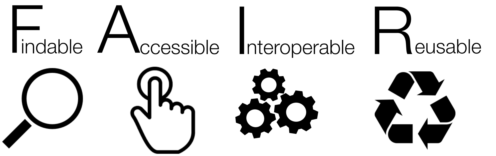

[life-cycle]: ../fig/101-intro/rdmkit-data-lifecycle.png
[high-disorder]: ../fig/101-intro/High_disorder.png
[low-disorder]: ../fig/101-intro/Low_disorder.png

> ## About this episode 
> The data that you collect, organise, prepare, and analyse to answer your research questions, and the documentation describing it, is the lifeblood of your research. However, without a prior idea of structure and how data will be used or viewed in the future, by yourself or someone else, the data can become difficult to understand, or even be rendered useless. A proper file and data structure will safeguard the data in both short and long term. Planning for file, folder and data maintainance can save researchers a lot of future time and effort. 
> 1. TOC
> {:toc}
> {: .toc}
{: .callout .toc}

> ### Exercise
> Question: What measures do you take in order to avoid file chaos in your data organisation?
> Write your answer in the collaborative document.
>
>> ### Example of measures
>> * Proper file naming 
>> * Versioning of files 
>> * Performing regular data cleaning 
>> * Agreeing on file access limitations 
>> * Adopting ISO standards for dates/times 
>> * Having a well defined folder structure
>> * Other (please state what) 
> {: .solution}
{: .discussion}

## The data life cycle

When we consider different aspects of data organization, we can benefit from considering the general data lifecycle.

<!-- ![Data Life Cycle][life-cycle]  -->

 

Throughout its lifecycle, data can, and will, be subject to many possible types of changes:

* Data will be created/accumulated/collected; 
* Data cleaning procedures may be implemented;
* Errors are often found and corrected;
* New variables may be constructed;
* New information may be added from external sources;
* File formats may be changed;
* New data may be included;
* The data file structure may be changed for the purpose of increasing operability, etc;
* Long term storage may require additional documentation

There are also possible types of changes to the data structure itself:

* New sub-projects can be initiated, or data splits may occur;
* Data files may be re-structured and/or re-organized into new folders;
* Collaborations can require certain data, but not all, to be stored in separate locations.

## Overview of data

Generating, processing, and analysing data inevitably result in edits in the data files and file structures. While natural, we need to preserve the authenticity of the research information contained in the data throughout the entire data lifecycle. At the same time we also try to maintain our intended file structure. To develop a strategy for data management in a project, we need to combine the project plan for data treatment with an overview of the data and documents our research will generate. The best time for planning is at the project startup phase, and a list of organisational considerations can consist of, but not be limited to:

* Initial and/or intended folder structure
* Which data files to cluster
* File naming convention
* Standards for dates/measures
* Documentation procedures

Preparing your project for receiving data and files should be a core aim in your research management, and should be documented in a data management plan (DMP). 

Sometimes projects increase in both size and scope, sub-projects form, and data production expands as new data are required and generated. When this happens, it may require changes and adaptations to already existant file structures. A file structure should be treated as a living document, continuously adapting to changes.

## Whom are we organizing the data for?
We all recognize the benefits from keeping things in order, having an overview, and knowing where things are. Not having to search for things we need reduce stress. But, we also have individual measures and standards for interpreting the quality of data organization. What makes sense to me may be illogical to you, and vice versa.

<!-- ![FAIR]  -->

 

The ultimate goal for research data is making it **FAIR** (**F**indable, **A**ccessible, **I**nteroperable, **R**eusable), thereby increasing its usefulness for the scientific community and society of today and tomorrow. Data can, should, and will, be important to more researchers than ourselves. It should be prepared and treated in such a way that it can be interpreted and used by others, as well as being adapted for indexing in a data repository. This may come in conflict with our everyday use of the data. The data and file structure we find most convenient for ourselves, here, today, may not be the most convenient structure for our future selves, other researchers in general, or from a long term storage perspective.

We need to settle for a file structure and data organization process that accomodates for the different phases of the data life cycle. 

## Reducing disorder
The perfect file system does not exist. No matter the intention or effort, all file systems accumulate disorder over time. Good file system management is better focused on practices decreasing the level of disorder rather than eliminating it completely. Systems lacking data management practises will more likely end up in a more chaotic state than maintained systems. 
 

 

![High level of disorder][high-disorder] 

Managing a file system does not by necessity require a lot of time. By selecting an interval for file system maintenance we can optimize effort vs. gain. Regular scheduled maintenance over a project life span can achieve more and require less time in total, than a single effort when the project is in its end phase.

![Low level of disorder][low-disorder] 

 

Do not postpone data organisation and file maintainance until the very last phase of your project!

> ## Exercise
> Rank the following data organisation steps from **1-5** (**1** being the one you think is most important, and **5** the least). Also mark with an "X" the steps you have implemented in your own projects. 
> - File naming convention
> - Folder naming convention
> - File versioning system
> - File organisation documentation (README.txt)
> - File and folder maintenance (moving, deleting)
>
>> ### Example of outcome
>> * 1&nbsp;X&nbsp;File naming convention
>> * 2&nbsp;&nbsp;&nbsp;&nbsp;Folder naming convention
>> * 4&nbsp;&nbsp;&nbsp;&nbsp;File versioning system 
>> * 5&nbsp;X&nbsp;File organisation documentation (README.txt) 
>> * 3&nbsp;&nbsp;&nbsp;&nbsp;File and folder maintenance (moving, deleting)
> {: .solution}
{: .discussion}

{: .callout}

