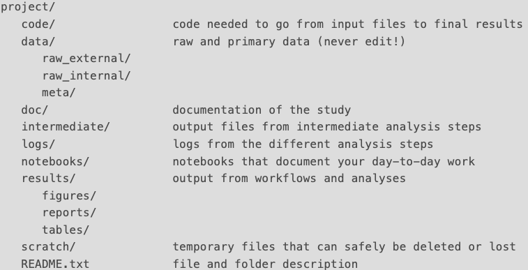

[multiple-tables]: ../fig/102-maintaining/2_Multiple_Tables.png
[conditional-formatting]: ../fig/102-maintaining/4_conditional-formatting.png

> ## About this episode 
> Scientific results are no stronger than the quality of the data they are based on, and the data quality is dependent on its integrity and authenticity. Developing good practise for maintaining data integrity and authenticity is therefore essential to guarantee high quality results.
> 1. TOC
> {:toc}
> {: .toc}
{: .callout .toc}

## Raw data
Raw data is collected or assembled data that has not been subject to modifications, or removal of outliers. Raw data is data as we receive it after collection and before we start working on it. It is also the most important form of data as the quality of your raw data is decisive for the quality of all results derived from it. Alterations to raw data will affect any downstream results and may impact reproducibility. 

Raw data should be treated in such a way that it:

* Has a clear and interpretable structure
* Prevents unintended modification
* Can be published and reused

### Versions of raw data
Consider a data collection. The data is compiled in a file and given a file name. Some time later we want to add new data. We collect and add it to the original file. Even later we add a second layer of additional data. Three potential versions of our raw data now exist. Do we acknowledge all three as independent files/sets, or do we only recognise a single, final version? The answer depends on the project and what data organisation strategy we apply!

- **Single file + Internal documentation**
 
All relevant information on what was added to the orignal data, and when, are stored in the data file itself and explained by labeling. Retrieval of the original data sets can be achieved based on the included information. 
 
    *Pros*: One data file. Information and data stored together
     
    *Cons*: May be difficult to extract versions of data without introducing human error. May end up mixing data that should be stored separately (e.g. restricted vs. non-restricted data). Information added in file may affect data readability.

- **Multiple files + External documentation**
 
Each version of data is stored separately. All relevant information on what was added to the original data and when are stored in a separate (README-)file.

    *Pros*: Easy to identify file versions for specific uses. Data in file not obscured by non-data information.  
    *Cons*: Increased file management. Long term storage and publication of data can be complicated. 

## Analyses and code
Analyses and data modifications should be documented in such a way that your treatment and results are reproducible (think **FAIR**). Avoid adding to the reproducibility crisis.

For results based on a subset of data: 
* Documentation should describe *how* (and *why*) the data subset was selected from raw data and *if* the subset was subject to *what* modifications prior to analysis 
* The analyses should be described in such a way that the results are reproducible by others, *using only that information* 
* Any script used should be stored in proximity with the results, referencing the data it was used with  

## Tabular data
A data spreadsheet is first and foremost a mode of data organisation. A common misconception is to treat a spreadsheet as a data file combined with a notebook (separating data and information based on visual distance and adding explanatory text notes in adjacent cells). We tend to visualize or structure information to reflect our intentions. From a computer perspective it makes little or no sense. A computer require extensive explanation to interpret spreadsheet data the same way a human does.

<!-- ![Image][multiple-tables]  -->

Consider the spatial organisation of data even before you begin adding data to your spreadsheet. The spreadsheet consists of rows, columns, and cells. Make sure you:

1. Put all your **variables in columns** - The thing you're measuring (e.g. *Length in cm*, *Attendance*, or *Gene*)
2. Put each **observation in its own row** - The individual measures (e.g. *180*, *Present*, or *MTND1-6*)
3. **Do not combine multiple pieces of information in one cell** - Sometimes it just seems like one thing, but it is easier to later combine single cell information, than to separate combined data into single cells
4. **Do not split combinable data in separate tables** - Even if it makes sense for a human, it can make export and analysis of your data unnecessarily complex.
5. Create a **data dictionary**! Explain, to yourself and future users, what column headers mean, the units of measure, if you use abbreviations, etc. Store the dictionary as a separate document in proximity to data. Avoid including the information in the data file! 
6. For storage, export and interoperability, export the cleaned data to a **text based format** like **TSV**, or **CSV**. This ensures that anyone can use the data, and is the format required by most data repositories.

An additional advice - If multiple contributors collect data in the same spreadsheet, make sure you enter the data in the same way! A spreadsheet containing data in multiple formats is a guarantee for errors and confusion! 

Things to consider when working with tabular data:

* **Do not**: Use colors to enhance or explain cells
* **Do not**: Spatially distribute data (computers prefer serially organised cells!)
* **Do not**: Mix data with analyses (Data visualisations in Excel, e.g. Diagrams)
* **Do not**: Represent missing values with empty cells (empty for humans does not equal missing for a computer)

<!-- ![Image][conditional-formatting]  -->

### Long term preservation of tabular data
Consider always saving binary data in alternative formats for long term storage or data archiving. This is especially true for tabular data. Clean data can always be exported as **CSV** or **TSV** and stored with a minimal amount of formatting. Plain or enriched text can be read by most software on multiple platforms.

> ### Learn more!
>
> - [Extended information and exercises on tabular data](../_episodes/105-tabular-data.md)
{: .discussion}

## File organisation
Any idea of organisation is better than no idea! Organisation is often based on the concept of clustering, and clustering is often done from a bottom-up or top-down perspective. 

**Bottom up** 
Similar or related files tend to be kept together in folders. Folders are then clustered in super folders, etc. 
 
*Example*: I collect my data in a folder, and create the analysis files in the same folder. I version or clone my data in one or more parallel folders and run more analyses there. I then create a super folder for all data/analysis folders and begin working on my manuscript there. After a while I restructure folders and sort the files to reflect my final view. 

- **Pros**: Easy model for everyday work, intuitive clustering inspired by workflow. 
- **Cons**: Easy to lose overview. Files may end up in "wrong" folders. Creates clutter.  

<!-- Image? -->

**Top down** 
Super folders are created first, then topic specific levels of sub folders. Clustering predates practise. 
 
*Example*: I create a project folder structure, with layers of sub folders for data, analyses, documentation etc. reflecting the project setup and workflow. When I generate data I place it in the data folder, make my analysis files in the analyses folder, and store my results in a separate folder. I begin working on my manuscript in a manuscript folder.  

- **Pros**: Process defined file structure, follows the workflow. Ideal for third person view of project.
- **Cons**: Rigid. Less flexible to work in with many folder levels and movements between folders in workflow. Files may end up (temporarily) in wrong folder due to leisure.  

<!-- Image? -->

In practice, we may end up with a combination of top-down and bottom-up structures. Starting with a top-down approach, we may create new sub folders based on a bottom-up work flow. Just remember - Keep track on what you do and why.

Working in projects where data is shared among several collaborators, a pre-defined top-down file structure may not fit any single individual, but will likely benefit the greater good of the project. It is a good idea to have one or two individuals responsible for overviewing and maintaining data structure in a shared environment.

Last but not least, always make sure to properly name your project folders so anyone can understand what project the contents are associated with. Full project name with funding serial number makes the data easily identifiable.

> ## Exercise
> Considering your own file structure, or the file structure used in your research group, write in the shared document: 
>
> 1. If your current file structure is top-down or bottom-up, or a mix of the two. 
> 2. Who the "inventor" of your file structure is (title, not name!), and to what extent you can influence how it is organized?
> 3. One thing you believe you could improve in your current file structure.
> 
>> ### Example of outcome
>> 1. My file system is mostly a top down structure. Files with uncertain associations are placed together in working folders, and may later be clustered in new folders when appropriate. 
>> 2. Since I am working in a shared environment, the file structure was decided by our PI. The structure is open for discussion and we sometimes makes adjustments to accomodate changes in our group workflow.  
>> 3. We have not yet adopted a file naming strategy, but will make it a priority in the near future.  
> {: .solution}
{: .discussion}

## File naming
A file naming convention is a framework, or protocol, for naming your files in a way that describes the file contents and, importantly, how they relate to other files. Adopting a good file naming convention will increase file findability, and make it easier to locate and search for specific files. 

A well suited file naming protocol should:

- Make it easy to understand what the file is and what it contains, from just reading the file name (**Human readable**)
    * Balance the amount of elements: too many makes it difficult to understand vs. too few makes it generic
    * Order elements from general to specific
    * Use meaningful abbreviations
    * Use underscore (_), hyphen (-) or capitalized letters to separate elements in the name. Don’t use spaces or special characters: ?!& , * % # ; * ( ) @$ ^ ~ ‘ { } [ ] < >
    * Use date format ISO8601: YYYYMMDD, and time if needed HHMMSS, or in combination YYYYMMDD:HHMMSS
    * Include a version number if appropriate
    * Write your file naming convention down and explain abbreviations in your data documentation

Examples of **good file names**:

- Honeybee project, experiment 2 done in Helsinki, data file created on the second of December 2020
    * *File name*: 20201202_HB_EXP2_HEL_DATA_V03.xls
    * *Explanation*: Time_ProjectAbbreviation_ExperimentNumber_ Location_TypeOfData_VersionNumber

- Cropped image of an ant head taken on the third of December 2020 by Meg Megson
    * *File name*: 20201203_MM_HEAD_CROPPED_V1.psd
    * *Explanation*: Time_CreatorData_TypeModification_Version

Examples of **poor file names**:
- Honeybee project, experiment 2 done in Helsinki, data file created on the second of December 2020
    * *File name*: Runnew_again_2NDTRY.xls
    * *Explanation*: N/A

- Cropped image of an ant head taken on the third of December 2020 by Meg Megson
    * *File name*: Image_antclose_first_PUBLISHTHISONE1?.psd
    * *Explanation*: N/A

- Avoid any name like file.txt, file_new.txt, file_newer.txt, file_try.txt, file_add_new.txt etc.
 
 

### Summary of principles for (file) names:
1. **Human readable** - A name describes the content of the file, connects to concept of a *slug* from semantic URLs (e.g. www.scilifelab.se/*this-is-a-slug*)
2. **Machine readable** – Avoid spaces, deliberate punctuation, accented characters, inconsistent letter casing 
3. **Default ordering** – Put something numeric first, use the ISO 8601 standard for dates (YYYYMMDD, or YYYY-MM-DD), left pad single digits with zeros (01, 02, 03... 10)
 
 

### Bulk file names
Data producing equipment (and software) might generate files with pre-defined names (e.g. a serial number or text string along with machine specific information. To a non-user such files can be incomprehensible, and requires explanation in order to make sense. To preserve the third-person view of files where the file name does not provide information of content or origin, documentation is required. Use sub-folders to cluster such files in manageable numbers and add README-files for orientation and explanation (Remember your future self!).

Continuous file name changes are sometimes required for generated data or analysis files. Manual modifications can be time consuming and introduce typos. Consider using a bulk file name change tool to save time, prevent errors and maintain consistency.

Tools for bulk renaming:
* Mac - [Renamer](https://renamer.com/) (Mac)
* Windows - [Bulk Rename Utility](https://www.bulkrenameutility.co.uk/) (Windows, free)
* Windows/Mac/Linux - R
 
 

### Documentation of file organisation
A well documented file organisation where structure and hierarchy is explained may appear unnecessary, but can be an essential tool for the longevity of the data. There are two cases where this is particularly important:

- **Shared projects** 
Settings where data is shared in a research group or among colleagues. A documented file system can guarantee files to be handled in a similar fashion by all involved. In settings where some individuals are more focused on data production, while others do data analysis, explicit documentation may safeguard data integrity and authenticity.

- **Project ending** 
After a project ends our memory will begin to fade on the specifics of file names and data contents. Considering yourself as a future "third person", a file structure documentation will be beneficial when revisiting your data, and aid in reusing the data and/or results.

File structures are best explained in plain text README-files. A good practice is to summarize contents of folders on separate levels, trying to answer the question "*What do someone else need to know about the contents of this folder in order to understand it?*". Adding such information will increase both data findability and reusability.

Example of folder structure and explanation in README.txt:

<!-- ![Image][file-tree]  -->

### Conditions and use:
If not already present, consider upgrading your file structure with an explicit 'Conditions and use' agreement, and apply it to file permissions, at least for raw data. Edits and changes to raw data should be restricted to only a few trusted individuals with particular responsibilities.

The same may be true for other files and folders. Large projects including many collaborators should have explicit permissions on file access. While it may seem democratic and trustful to allow everyone equal and full access to everything, restricted access will reduce the risk of unintended mistakes and accidents.